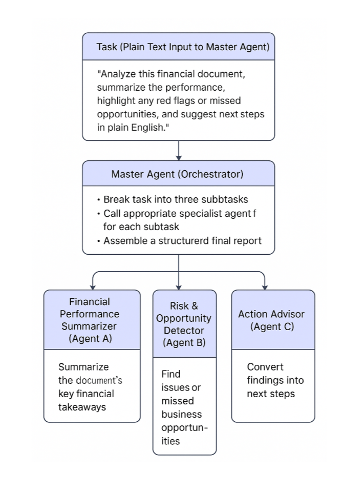

🧠 Agent Flow Logic with Multiple Agents

🔷 Task (Plain Text Input to Master Agent)

“Analyze this financial document, summarize the performance, highlight any red flags or missed opportunities, and suggest next steps in plain English.”

👥 Agent Team Setup

🧑‍✈️ Master Agent: "Orchestrator"
Receives the plain-language task from the user.
Breaks the task into three subtasks:
Summarize financial performance
Identify red flags or missed opportunities
Suggest next-step actions in plain English
Delegates to the appropriate specialist agent for each subtask.
Assembles a structured final report.

📊 Agent A – Financial Performance Summarizer
Role: Summarizes the document’s key financial takeaways.
Speciality:
Trends in revenue, expenses, profit/loss
Notable shifts or anomalies
High-level snapshot
Prompt style:
“Based on this financial document, give a concise summary of business performance in clear terms.”

🚨 Agent B – Risk & Opportunity Detector
Role: Finds issues or missed business opportunities.
Speciality:
Flags risks (e.g. rising costs, unpaid invoices)
Missed opportunities (e.g. underutilized assets, revenue gaps)
Prompt style:
“List any potential financial red flags, risks, or missed opportunities in this document. Provide a one-line explanation for each.”

✅ Agent C – Action Advisor
Role: Converts findings into next steps.
Speciality:
Converts issues and summaries into actionable insights
Explains in friendly, plain English
Prompt style:
“Given the financial summary and list of risks, suggest clear, plain-English actions a small business owner can take.”

🧰 Optional Tools Setup (LangChain-style)
DocumentLoader: PyPDFLoader, UnstructuredFileLoader
TextSplitter: RecursiveCharacterTextSplitter
Embeddings: OpenAIEmbeddings
VectorStore: FAISS

Agent Tools:
summarize_doc()
find_risks_and_opportunities()
generate_plain_english_recommendations()

